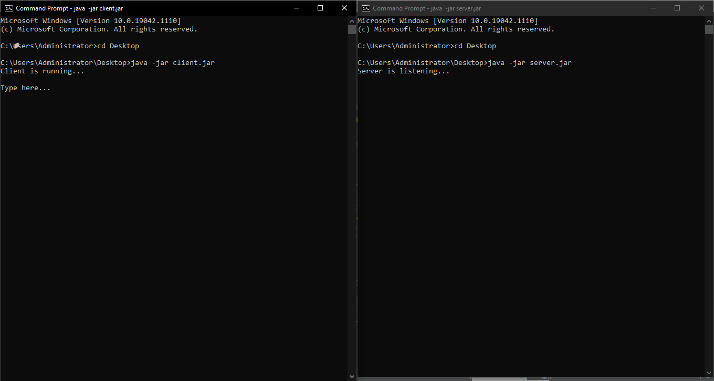
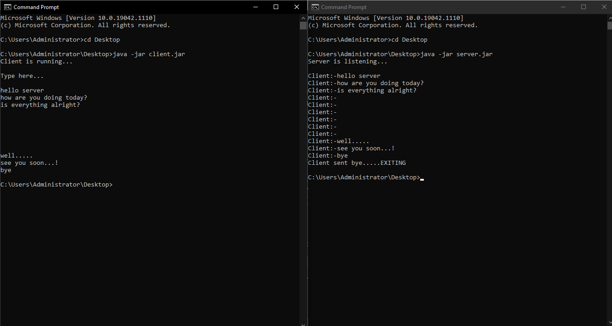
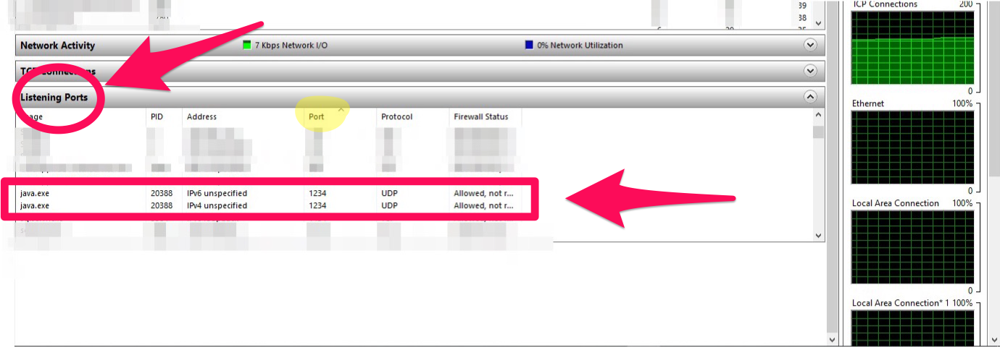

## UDP-Implementation
Basic UDP implementation of Client and Server.

### How it works:
  1. Export each file as a Runnable JAR File.
  --------------------------------------------------------------------------------------------------------------------------------------------------------------------
  ## How To Export Files as Runnable JAR?
     1.1. Right Click on the file in your IDE.
     1.2. Choose Export from the options.
     1.3. Under `Java` tab, you'll find Runnable Jar file.
     1.4. Launch the configurations and choose file destination.
          1.4.2. Save them on Desktop. (e.g. Client.jar , Server.jar)
  --------------------------------------------------------------------------------------------------------------------------------------------------------------------
  2. Open CMD twice. (1 for Client and 1 for Server)
  --------------------------------------------------------------------------------------------------------------------------------------------------------------------
  3. Run each file independently.
  --------------------------------------------------------------------------------------------------------------------------------------------------------------------
  ## How To Run The JAR Files?
    3.1. Navigate to your Desktop (cd Desktop)
    3.2. Run this command on first cmd: java -jar "fileName1".jar (i.e. if your file is called Client.jar: java -jar Client.jar).
    3.3. Run this command on 2nd cmd: java -jar "fileName2".jar (i.e. if your file is called Server.jar: java -jar Server.jar).
  4. Send messages to server. type "bye" to exit.

--------------------------------------------------------------------------------------------------------------------------------------------------------------------

### Running App:
Right after running the app.
 

--------------------------------------------------------------------------------------------------------------------------------------------------------------------
### Sending some messages to Server:
 

--------------------------------------------------------------------------------------------------------------------------------------------------------------------
### Listening Ports on "Resource monitor":
 

--------------------------------------------------------------------------------------------------------------------------------------------------------------------
